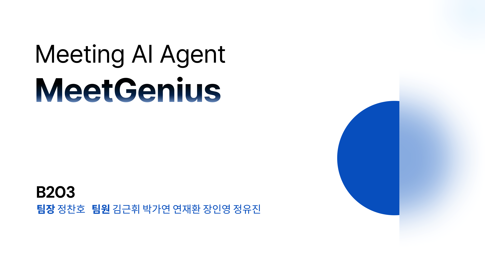
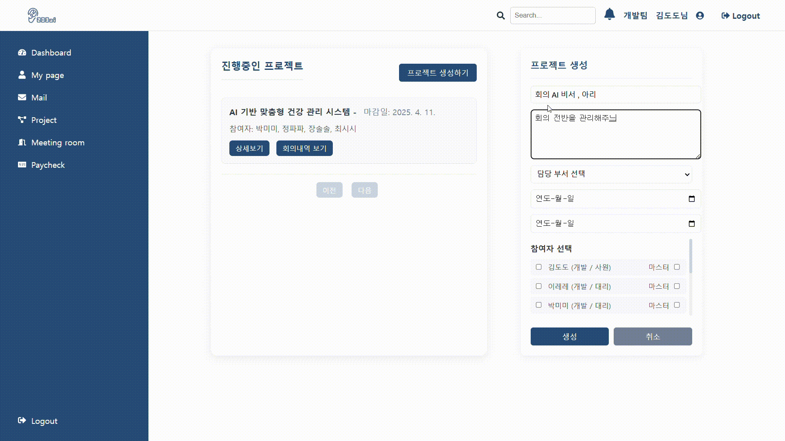
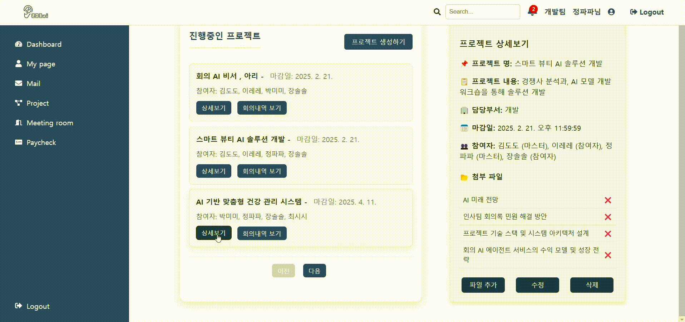
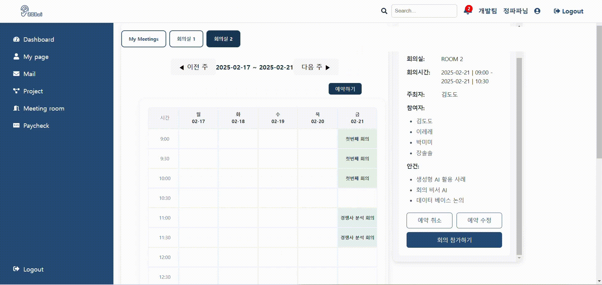
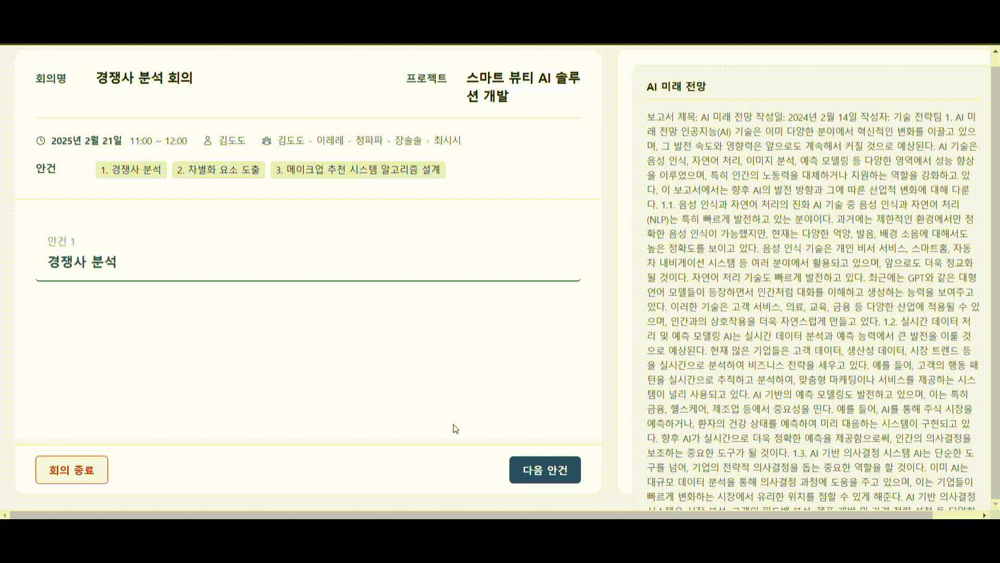
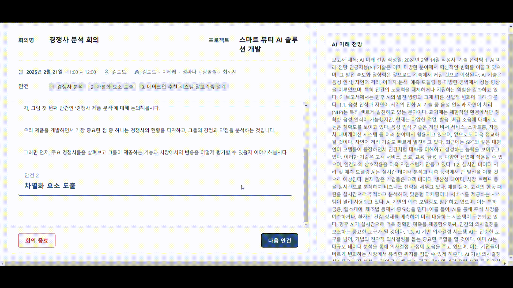
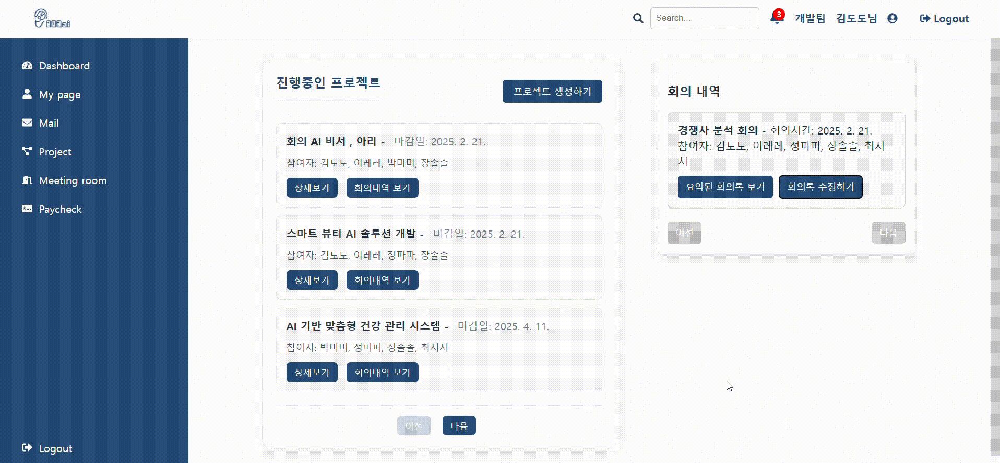
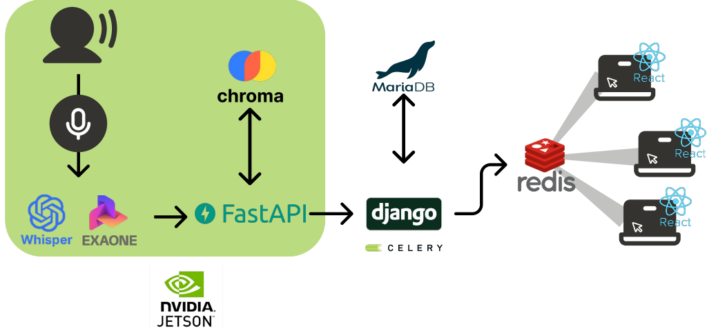
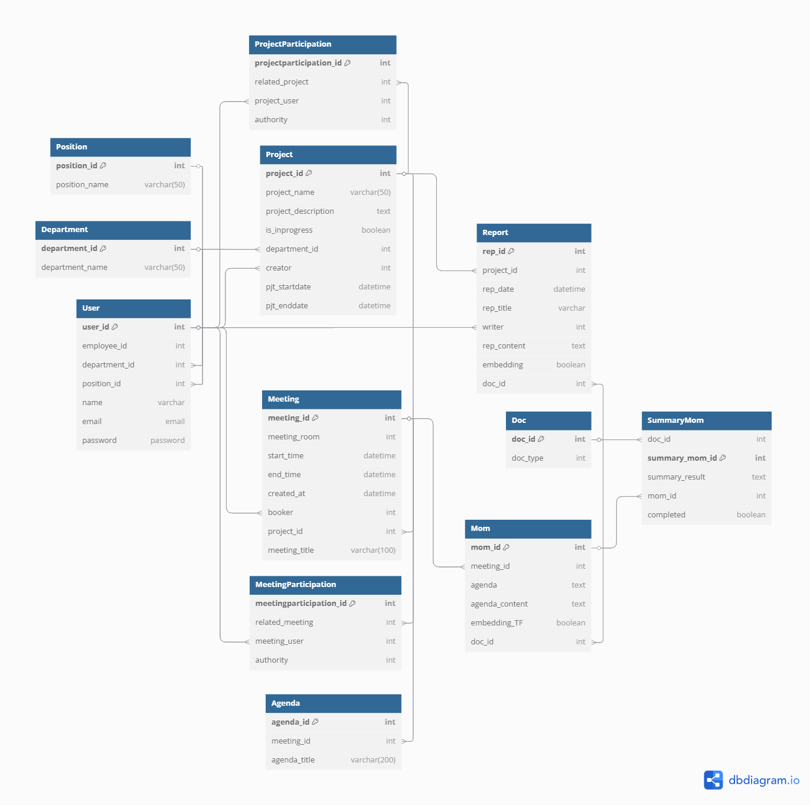

# MeetGenius

 

## 💡 개요
- 서비스명 : MeetGenius
- 진행기간 : 2025.01.06 - 2025.02.21.
- 주제 :  온디바이스 AI 회의 비서
- 주관: 삼성 청년 SW/AI 아카데미
- 설명 : 
    - MeetGenius는 유저 관리부터 프로젝트 생성 및 관리, 관련 문서추가, 회의 예약 및 관리 기능을 제공합니다.
    - MeetGenius는 **음성 데이터를 기반으로 회의를 실시간 처리**하며, **RAG 기반으로 관련 문서를 검색해 답변을 제공**합니다.

## 👨‍👩‍👦‍👦 멤버

  
|       | 역할 |
|--------|-------|
|정찬호| PM, Infra, Data|
|김근휘| Back-end 개발(Django, Fast API)|
|박가연| Data, AI|
|연재환| Data, AI, Back-end 개발 (Fast API)|
|장인영| Back-end 개발(Django), Front-end 개발(React.js)|
|정유진| Front-end 개발(React.js), Design(Figma)|

<br>

##  ⚙️ 기술 스택
### Frontend


### Backend


### AI/Data


### Infra


### Environment


<br>

## ❗ 기획 배경
### 사용자 페인 포인트 및 니즈

1. **보안성**
    - 페인포인트: 최근 기업 기밀정보의 외부 유출 사례가 증가하면서, 클라우드 서버 의존 시 보안 취약점(물리·네트워크·시스템 등)이 발생할 가능성이 높음.
    - 니즈: 기업 내부망(온프레미스)에서 데이터를 처리하여 기밀정보를 안전하게 보호하고, 보안 리스크를 최소화할 수 있는 솔루션 필요.
      
2. **비효율적인 회의 운영**
    - 페인포인트: 회의록 작성, 관련 문서 탐색, 회의 내용 정리 등의 단순 반복 업무가 많아 비효율적임.
    - 니즈: 프로젝트 및 회의 정보를 한곳에서 통합 관리하고, 회의 생산성을 높이는 자동화 솔루션 필요.

### 서비스

1. **보안 강화**
    - Jetson Orin 보드를 활용한 온디바이스 AI 회의 비서를 제공하여, 모든 데이터가 내부망에서 처리되도록 보장함.

2. **효율적인 회의 운영**
    - 반복적인 회의 기록 및 회의록 작성 업무를 자동화하여 회의 생산성을 극대화함.
    - 프로젝트와 회의 정보를 통합 관리하여 불필요한 업무를 줄이고, 실질적인 논의에 집중할 수 있도록 지원함.

3. **실시간 정보 활용**
    - 회의 도중 필요한 문서를 신속하게 검색하고, 특정 키워드(STT)을 트리거로 관련 정보를 즉시 제공하여 의사결정 속도와 정확성을 향상함.
    - 회의 중 생기는 이슈나 과제에 대해 즉각적인 판단을 내릴 수 있도록 지원함.

4. **STT 기술 결합으로 사용성 제공**
    - 실시간 음성인식(STT) 기술을 활용하여 회의 내용을 자동으로 텍스트로 변환함.
    - 이를 통해 회의록 작성 시간을 줄이고, 기록된 내용을 쉽게 검색 및 분석할 수 있도록 함.


## **📌 설계 및 개발 시 집중한 요소**

### **1. 온디바이스 AI 경량화 (Jetson Orin)**
- 온디바이스 환경(**Jetson Orin nano**)에서 AI(STT 및 RAG) 작업을 처리해야 했음 : 제한된 메모리(RAM) 용량 
- AI 모델의 **경량화**를 통해 **실시간 STT, RAG, 회의록 요약 속도 및 정확도 최적화**
- RAG 에 사용되는 임베딩 모델(KoE5)을 양자화하여 모델 사이즈를 약 70% 가까이 감소 (2.24GB-> 0.7GB)  
---

### **2. 실시간 회의 데이터 동기화 (Redis + SSE)**
- 모든 회의 참여자가 **동일한 회의 화면**을 볼 수 있도록 **Redis Pub/Sub + SSE(Server-Sent Events) 기반 동기화 구현**  
- 모든 회의 내용을 적절한 Key값을 활용해 **Redis에 저장 및 Publish**, 프론트엔드는 **SSE를 활용하여 실시간 수신**  
- **Django에서 Redis를 활용한 중계 역할** 수행  
    - **발언 내용 및 STT → FastAPI → Django → Redis → Web(React)로 실시간 전파**  

---

### **3. DB 최적화 및 대용량 문서 검색 속도 개선**
- **프로젝트, 회의, 문서 데이터 간의 관계 최적화**  
- **select_related()** 사용을 통한 **N+1 문제 해결 및 DB 조회 성능 향상**  
- 벡터 DB(ChromaDB)와 관계형 DB(MariaDB)의 조합을 활용하여 **대용량 문서 검색 성능 최적화**  
- **벡터 검색을 먼저 수행(유사한 문서 ID 획득) → MariaDB에서 상세 문서 정보 조회**  

---

### **4. RAG**
- RAG(Retrieval-Augmented Generation)을 활용한 실시간 회의 도중 질의응답 
- 프로젝트 관련 문서들을 기반으로 LLM이 사용자 질문에 적합한 답변을 생성
  - 프로젝트 관련 문서들을 벡터 DB 인 ChromaDB를 통해 관리 
- LG EXAONE3.5(2.4B) 모델을 활용하여 한국어 질의에 특화되도록 설계 
- RAG를 활용함에도 발생하는 할루시네이션 현상 감소 
  - Lost In the Middle 현상을 방지하기위해 프롬프트 엔지니어링을 통해 최적화 진행 

### **5. 회의록 작성 및 요약**
- STT(음성 데이터) → 회의록 초안 자동 생성 → AI가 요약하여 최종 회의록 작성  
- AI 회의록 요약 기능을 추가하여 **중요 발언만 정리 & 핵심 내용 강조**
- LG EXAONE3.5(2.4B) 모델과 프롬프팅을 사용하여 한국어 회의록 요약에 최적화되도록 설계  

---


<br>

## 🖥️  서비스 대표 기능

> - **실시간 STT 기반 회의록 생성**  
> - **Redis 기반 다중 사용자 동기화**   
> - **회의 중 AI 비서(아리)에게 질문 가능**  
> - **프로젝트 단위 회의 관리 및 문서 탐색**  
> - **회의 요약 및 자동 보고서 생성**  

**1. 프로젝트 생성**

- 프로젝트 생성: 프로젝트 이름, 내용, 참여자 목록을 입력하여 프로젝트 단위로 관리할 수 있음

 

</br>

**2. 프로젝트 문서 삽입**

- 프로젝트 관련 문서 삽입: 문서는 Maria DB에 저장된 후 **Chroma DB에 벡터화**되어 저장 → **회의 중 AI 비서(아리)의 문서 탐색에 활용**  

 

</br>

**3. 회의 예약**
- 회의 예약: 프로젝트 참여자 목록을 자동으로 불러와 편리한 회의 설정
- 실시간 회의 페이지에서 안건과 관련된 문서를 확인할 수 있음

 

</br>

**4. 프로젝트 삭제 및 회의 취소 제한**
- 프로젝트 삭제 제한: 프로젝트 마스터가 아닌 경우 프로젝트 삭제가 제한됨  
- 회의 취소 제한: 회의 참여자가 아닌 경우 회의를 취소할 수 없음




</br>
   
**5. 실시간 회의 기록**
- 회의 내용을 기록하고, 실시간 회의 페이지에서 해당 내용을 제공
- **STT(음성 인식, Whisper Model) 기반 실시간 회의록 생성**  
- 회의 내용은 Redis를 통해 모든 사용자에게 동기화



</br>

**6. 프로젝트 문서 기반 AI 질의응답 (RAG)**
- **회의 중 AI 비서(아리)에게 질문 가능**  
- **ChromaDB에서 관련 문서를 검색 후 AI 답변 제공**  
- **알고리즘**
    - **1. [FastAPI, Jetson] 문서 유사도 검사**
        - 문서 추가 시 함께 전달된 **메타데이터(문서 ID, 프로젝트 ID 등)**를 활용
        - 회의 안건과 유사한 문서를 **벡터DB(ChromaDB)**에서 검색
        - 유사도가 높은 상위 3개의 문서(Document IDs) 반환
    - **2. [Django, Web] 데이터 처리 및 Redis 전송**
        - 반환된 document_ids를 MariaDB에서 검색
        - 관련 문서를 Redis에 저장 및 SSE(Server-Sent Events)로 실시간 전송
    - **3. [React, Web] 해당 데이터 처리**
        - 웹 애플리케이션(React)에서 Redis의 SSE 스트림을 수신
        - 실시간으로 관련 문서를 화면에 표시
  


</br>

**7. 동일한 화면**
- 모든 사용자에게 동일한 회의 기록을 제공
- **회의 내용은 Redis를 통해 회의id별로 사용자(회의 참여자)에게 동기화**하여 참여 시점에 관계없이 회의 내용 확인 가능
- **알고리즘**
    - **Redis를 활용한 실시간 데이터 동기화**
        - 참고 문서(documents)
        - 안건 정보(agendas)
        - 현재 안건 정보(cur_agenda)
        - STT 데이터(STT_data)
        - 지난 안건 STT 데이터 (STT_history)
    - Django가 Redis Pub/Sub을 통해 데이터 전송, 프론트엔드는 SSE를 활용해 실시간 반영


</br>

**8. 회의록 요약**
- 회의 전체 내용을 확인하고 수정 가능
- 수정 후, AI 회의 비서가 회의록을 요약
- 회의 요약에는 약 10s 소요 (500자 미만)
- **알고리즘**
    1. Django에서 FastAPI에 요약 요청 (Celery 활용한 백그라운드 처리)
    2. FastAPI에서 전달받은 안건 별 회의록 내용 ChromaDB에 저장
    3. FastAPI에서 AI 모델을 통해 안건별로 회의록 내용 요약 후 반환
    4. Django가 받은 요약 결과를 MariaDB에 저장 후 프론트엔드에 전달달



</br>

<br>

## 📄 설계 
### 아키텍처
   

 </br>

   

### ERD
   


<br>

## **Git 전략**
 
### **1. 브랜치 전략**
 - `master` : 배포용 브랜치  
 - `DEV/WEB`, `DEV/JETSON` : 개발용 브랜치 (모든 기능 브랜치는 여기서 파생)  
 - `feature/{기능명}` : 새로운 기능 개발  
 - `fix/{버그명}` : 버그 수정  
 - `hotfix/{긴급버그명}` : 긴급 버그 수정  
 - `chore/{기타작업}` : 설정 변경, 문서 수정 등  

모든 PR은 각각의 `DEV` 브랜치로 병합하며, 코드 리뷰를 필수로 진행합니다.

---
### **2. 커밋 컨벤션**
**📌 목적**
팀원 간 일관된 커밋 메시지를 유지하여 작업 내용을 쉽게 추적할 수 있도록 합니다.
JIRA와 연동된 TASK를 커밋 메시지에 포함하여 업무 공유를 원활하게 진행합니다.
**📌 커밋 메시지 형식**
```
Type(Scope): 작업 내용 요약

상세 설명 (필요하면 추가)

#이슈번호
```

**✅ 예시**
```
feat(BE): 로그인 기능 추가

 유효성 검사를 모두 마친 로그인 기능 추가
 
 #S12P11B203-16
 ```

 ---

 **📌 커밋 Type 정의**
 | Type      | 설명 |
 |-----------|----------------------------------------|
 | feat      | 새로운 기능 추가 |
 | fix       | 버그 수정 |
 | docs      | 문서 작업 (예: README 수정) |
 | style     | 코드 포맷팅, 세미콜론 누락 등 코드 스타일 수정 (기능 변화 없음) |
 | refactor  | 리팩토링 (기능 변경 없이 코드 구조 개선) |
 | test      | 테스트 추가/수정 |
 | chore     | 빌드 작업, 패키지 관리 등 기타 변경 사항 |
 
 ---

 **📌 Scope 정의**
 | Scope  | 설명 |
 |--------|----------------------------|
 | FE     | 프론트엔드 관련 작업 |
 | BE     | 백엔드 관련 작업 |
 | AI     | 인공지능 관련 작업 |
 | DA     | 데이터 분석 관련 작업 |
 | EM     | 임베디드 관련 작업 |
 | ETC    | 기타 작업 |
 
 ---

<br>

## 프로젝트 회고
| 팀원     | 소감 |
|---------------|------------|
| 정찬호 🐨 | 마지막 2주가 너무 빡빡했습니다.<br>느리긴 했지만 결과적으로 성공적인 구현 및 시연을 해서 가장 보람 있었던 순간인 것 같습니다.<br>또한 웹단의 플로우를 잘 알지 못하고 시작한 점이 아쉬웠습니다.<br>팀장과 PM을 동시에 맡기에는 타 개발을 병행하기 어려운 느낌이 들었습니다.<br>도커 Desktop을 미리 설치하고, GitLab에 Docker 환경까지 설정해 개발자들이 바로 사용할 수 있도록 했으면 어땠을까 하는 생각이 들었습니다. |
| 박가연 🐥 | IoT 기술을 활용한 프로젝트는 처음이라 신기했고, 좋은 경험이었습니다.<br>웹과 Jetson 사이에서 주고받아야 하는 데이터의 변동 사항이 많아 어려웠지만, FastAPI로 엔드포인트를 작성하며 데이터 파이프라인을 구축하는 과정이 흥미로웠습니다.<br>데이터 담당을 맡았지만, 기술 지식의 한계를 많이 느꼈습니다. |
| 연재환 🤖 | ARM 아키텍처 기반의 Jetson Orin Nano 초기 세팅이 까다로웠으나, 공식 문서 및 GitHub Issue들을 확인하며 개발 환경을 성공적으로 구축한 점이 보람찼습니다.<br>또한, LLM 모델의 할루시네이션 원인(Lost in the Middle)을 분석하고 해결한 과정도 뜻깊었습니다.<br>마지막 주차에서 Jetson과 웹을 연결하는 과정에서 발생한 버그 해결과 Side-Effect 수정이 어려웠습니다.<br>다음 프로젝트에서는 파트 간 및 팀원 간 주기적인 소통과 진행 사항 공유, 유기적인 역할 분담에 더욱 힘써야겠다고 느꼈습니다. |
| 김근휘 🐶 | 명확한 설계 없이 개발을 진행하면서 중간에 코드를 엎어야 하는 상황이 발생했습니다.<br>급하게 재설계하여 위기를 넘기고 기능을 구현했지만, 설계의 중요성을 다시 한번 깨달았습니다.<br>스트리밍 기능을 구현할 때 소켓과 SSE, 폴링을 두고 고민했으며, 최소한의 비용으로 동일한 성능과 기능을 구현하는 데 성공하여 보람찼습니다.<br>다음 프로젝트에서는 <br>**① 팀원들과 기획·설계·개발 모든 부분에서 동일한 이해도를 유지할 것, <br> ② 기능이 겉보기에 동작한다고 코드 리뷰를 소홀히 하지 않을 것, <br>③ 설계 단계에서 구현 방법을 충분히 고민할 것**을 지키도록 하겠습니다. |
| 장인영 🐹 | 중간에 인력 부족으로 인해 프론트엔드 개발에 투입되었는데, 새로운 경험이라 재미있었습니다.<br>프론트 코드 리팩토링을 진행하며, 기존 기능에 영향을 주지 않으면서도 코드 간결화에 성공한 점이 보람 있었습니다.<br>다음 프로젝트에서도 백엔드를 맡게 되었으므로, 프론트엔드와의 데이터 서빙 방식을 고민하고, 통신 구조를 학습하며 더욱 효율적인 개발을 목표로 하겠습니다.<br>또한, 프로젝트의 목적에 적합한 기술을 찾아 적용하는 데 더욱 신경 쓰겠습니다. |
| 정유진 🐇 | 이번 프로젝트에서는 와이어프레임 설계부터 Figma를 활용한 UX/UI 디자인까지 전체적인 사용자 경험을 고민하는 데 많은 어려움이 있었습니다.<br>특히 React를 처음 접하면서 아키텍처 설계와 컴포넌트 구조화에 난관이 있었으나, 꾸준한 학습과 반복적인 구현 과정을 통해 점진적인 성장과 성과를 확인할 수 있었습니다.<br>페이지가 실제로 동작하는 모습을 보며 개발자로서 큰 성취감을 느꼈고, 2학기 첫 프로젝트인 만큼 특별한 책임감과 애정을 가지고 임했습니다.<br>이번 경험을 통해 디자인과 개발 양 측면에서 한층 더 깊이 있는 이해를 쌓았으며, 앞으로는 코드의 효율성과 유지보수성 향상을 위해 더욱 체계적인 설계와 최적화된 개발 방식을 연구하고 적용해 나가겠습니다. |